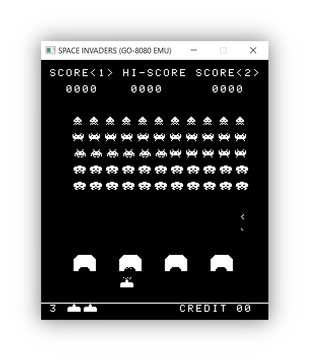
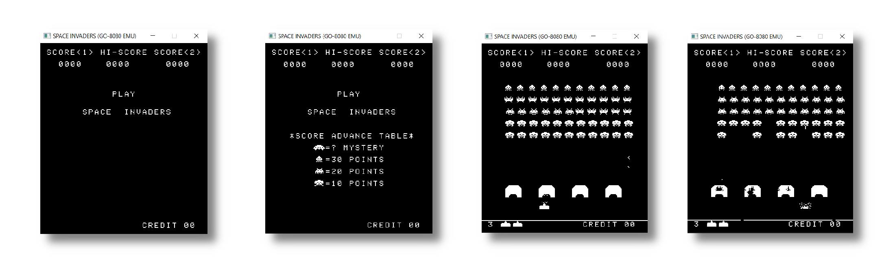
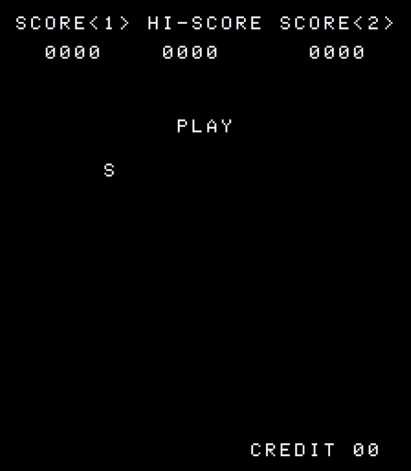

<!-- PROJECT LOGO -->
<h1 align="center">
  <br>
  <a href="https://github.com/BotRandomness/GO-8080"></a>
  <br>
  <b>GO-8080</b>
  <br>
  <sub><sup><b>GO-8080, a Intel 8080 emulator, running Space Invaders, written in Go.</b></sup></sub>
  <br>

</h1>

<a href="https://github.com/BotRandomness/GO-8080">
    
</a>

<p align="center">
<strong><em>Let's set the scene:</em></strong> after finishing my Chip-8 emulator, I just had a itch to make another emulator. <em>"What could it be?"</em> I said, and after looking at my options, I thought it would be really cool to make a <strong>Intel 8080 emulator</strong>, that can run the orignal <strong>Space Invaders!</strong> You may be wondering, <em>What makes the Intel 8080 CPU so speical?</em> Well let's start with the facts, the <strong>Intel 8080</strong> is a <strong>8-bit microprocessor</strong> released in <strong>1974</strong>, clocked in at <strong>2 MHz</strong>, and what made it so speical? Well here's the history you are looking for, this mircoprocessor was really the <strong>first that actually made computing for personal computers really possible</strong>. Before then, microprocessors out then were not consider to be powerful enough, but the Intel 8080 changed this notion, being used in the what is to be consider the first personal computer <em>(at least powerful enough)</em>, the <strong>Altair 8800</strong>. This new power changed the game, with the Intel 8080 being used in many computers, including <strong>arcade cabinets</strong>. This revolutionize the computing scene, leading the impacts that can be felt to this day. The Intel 8080 lead to the Intel 8086, which is where we <strong>stem our modern x86 architecture processor</strong> from, which is what most home computers use today! As for <strong>Space Invaders</strong>, it was made by <strong>Tomohiro Nishikado</strong>, publish by <strong>Taito</strong>, in <strong>1978</strong>. Space Invaders itself was <strong>influential to the video game industry</strong>, bringing on what's known as the <strong>golden age of arcade gaming!</strong> Now you see why I found this really <strong>cool and interesting!</strong> You may be saying, <em>That is really cool, but why did you use Go and raylib to make a emulator?</em> I never used <strong>Go</strong> and thought it would be a <strong>good learning opportunity as a first project in the language as a challenge.</strong> As for raylib, why not, <strong>it's fun! :)</strong>

</p>

</div>

<!-- ABOUT THE PROJECT -->

## Getting Started
Want to use it, and mess around? Here's how you can get started!
### Download
#### Windows
1. Download it from [here](https://github.com/BotRandomness/GO-8080/releases), or on the releases page.
2. Unzip the folder
3. Open the `GO-8080.exe`
4. You are ready to go!
#### MacOS/Linux
1. Download it from [here](https://github.com/BotRandomness/GO-8080/releases), or on the releases page.
2. Unzip the folder
3. Run `./GO-8080`
4. You are ready to go!
### Controls
- Arrow keys `[<-][->]` To move left and right
- [SPACE] bar is to shoot
- (C) key is to insert coin
- (X) key is start for PLAYER 1

### Usage
#### Flags
By default, the GO-8080 runs Space Invaders, however executing the executable through the command line allows you pass in flags for greater configuration. Note, these flags can be passed in any order, and in any combination.
- `-c` Runs `cpudiag.bin` test rom
- `-t` Runs `TST8080.COM` test rom
- `-d` Enables debug trace of the assembly (Note: for Space Invaders, this will make it run slow depending on your system)
- `-f` Enables FPS counter (Note: Space Invaders only, also debug flag also shows FPS for Space Invaders)
- `-s <Int Value>` Scale sets the window size (Note: Space Invaders only)

## Screenshots
<a href="https://github.com/BotRandomness/GO-8080">
    
</a>
<p align="center"> Screenshots of demo sequence </p>

### Demo Gameplay
<a href="https://github.com/BotRandomness/GO-8080"></a>

## Compatibility
```
GO-8080
Intel8080 init
1536 bytes loaded into memory
MICROCOSM ASSOCIATES 8080/8085 CPU DIAGNOSTIC
 VERSION 1.0  (C) 1980

 CPU IS OPERATIONAL
```
<p align="center"> Passes TST8080.COM and cpudiag </p>

## Compile
Want to tinker around, modify, make your own, learn a bit about emulation development, or contribute? Here's how you can get started with the code and compile.

To get started, you need to have GO install, as well as the raylib-go binding library

1. Download Go: https://go.dev/
2. Next, to download the raylib-go binding, head to [this](https://github.com/gen2brain/raylib-go) repo for installing the libary for your system. Note, for Windows, I already included the `raylib.dll` from the raylib repo, so a C compiler on Windows is not required.
3. Clone this repository, and point your terminal to the root directory of the repository
4. Run `go run ./src` to compile, and it should run right after!

### Program Architechture
Here's a little information on the program layout!

Looking over the code, the program is quite simple, don't worry! This portation was written to be simple, so no matter of your skill level, anybody should get the idea of the program works, it's sort of the reason why I write these parts! :)

Go does not use classes, so we can't create objects in the traditional way. However, we are able to make structs with methods known as receivers with pointers. This approach was used to make a `cpu` struct. Here's the struct is organized:
```go
type cpu struct {
	regs map[string]uint8 //a, b, c, d, e, h, l 8-bit registers
	pc, sp uint16 //special 16-bit registers
	zero, sign, parity, carry, ac bool //flags (Z, S, P, CY, AC)
	memory [65536]uint8 //64KB of memory (0x000-0x1FFF=ROM, 0x2000-0x23FF=RAM, 0x2400-0x3FFF=VRAM, 0x4000-0xFFFF=RAM Mirror)
	
	opcode uint8
	byte2 uint8
	byte3 uint8
	addr uint16
	
	//extra regs/control var for Space Invaders Arcade Cabinet hardware
	interruptEnable bool
	shiftReg1 uint8
	shiftReg2 uint8
	shiftOffset uint8
	controlFlag uint8
}
```
This struct lives in the file `8080.go`, which is a good time to bring up how the code is actually organized. In Go, everything is organized in packages. Packages can have groups of code that is responsible for a certain task. However, with this project, for the sake of simplicity, everything is in package main. Each Go file handles one part of the emulation, so `8080.go` is all the actual Intel 8080 code, and `invaders.go`, `cpudiag.go`, and `cpmbdosTST8080.go` handles the way the CPU will be used in each of those program, including additional hardware emulation, or OS calls. `main.go` simply brings all these components together. You may have notice a particular thing with the `cpu` struct, like how it contains variables relating not directly realted to the CPU. That brings on number two of how the code is organized. You remember how I mentioned the other Go files handles additional hardware emulation, well I made those extra componets and the receiver methods part of the `cpu` struct. For this project, it's ok, but ideally, everything should be isolated, especially in Go, how they can be divided in packages.

Let's get on how the main Intel 8080 emualtion is done in the `8080.go`.

The CPU code is layout pretty simply. The Intel 8080 has 7 registers known as `a, b, c, d, e, h, l`, and 1 flag register known as `f`, but I used bool variables to represent each of those flags. Those flags being `zero, sign, parity, carry, auxiliary carry`. These flag variables are updated depending on the instruction with a input value. These flag update are done in a higher range of bits, so using 16 bits, then casting the result back to unsign 8 bits. Also the 8 bit registers can pair up to form a 16 bit registers, these pair include `bc, de, hl`. There are also 2 dedicated function to handle 16 bit value loading and setting depending on what pair is needed. Looking at the code should give an idea of these flags and 16 bit pair registers are handle. 

The Intel 8080 has around 256 for all the different opcodes for the different instructions. However many of these instructions does very simular things. Instead of write the same type of code over and over again with slight modifications, we can create a general function. For example, the `MOV` instruction has many variation for each register combination. Instead of writing the same thing over and over again, we can make a function:
```go
func (cpu *cpu) MOVR1R2(r1 string, r2 string) int {
	cycle := 5
	cpu.regs[r1] = cpu.regs[r2]
	cpu.pc++
	return cycle
}
```
Now going into the main `executeInstruction()` function, we can see a switch statement that fetches the opcode, decodes it, and then executes it. Here is how the basics of that is laid out:
```go
func (cpu *cpu) executeInstruction() int {
	cpu.opcode = cpu.memory[cpu.pc]
	cpu.byte2 = cpu.memory[cpu.pc + 1]
	cpu.byte3 = cpu.memory[cpu.pc + 2]
	cpu.addr = uint16(cpu.memory[cpu.pc + 1]) | (uint16(cpu.memory[cpu.pc + 2]) << 8)
	cycle := 0

	switch cpu.opcode {
		case 0x00:
			cpu.trace(1, "NOP")
			cycle = cpu.NOP()
		case 0xC3:
			cpu.trace(3, "JMP addr")
			cycle = cpu.JMP()
                ...
                case 0x41:
			cpu.trace(1, "MOV (B)b, (C)c")
			cycle = cpu.MOVR1R2("b", "c")
                case 0x78:
			cpu.trace(1, "MOV (A)a, (B)b")
			cycle = cpu.MOVR1R2("a", "b")
...
}
```
The Intel 8080 opcodes range in size for 1 to 3 bytes. The first byte is the opcode, while the byte 2 and byte 3 are extra values the instruction may use. They are stored right after the other. For each case, we call the instruction function, and pass the registers it's going to work with. Another thing you may have notice, the registers are not individual variable, nor are they array, but are what Go calls maps. They map a string value to a index value. I mostly did this for readablity, however note doing individual variable and passing in a reference would achieve the same thing, and is something I am looking into doing. Most of CPU code follows this structure.

## Credits/Resources
To build my Intel 8080 emulator, I used these documentations:
- Intel 8080 Assembly Language Programming Manual: https://altairclone.com/downloads/manuals/8080%20Programmers%20Manual.pdf
- Intel 8080 Microcomputer Systems User's Manual: https://archive.org/details/bitsavers_intelMCS80ocomputerSystemsUsersManual197509_43049640
- Intel 8080 Instruction Set Opcode Table: https://pastraiser.com/cpu/i8080/i8080_opcodes.html
- Computer Archeology Space Invaders: https://computerarcheology.com/Arcade/SpaceInvaders/Hardware.html
- Emulator 101's Intel 8080: http://www.emulator101.com/

These documentations were so useful, I recommend anyone give them a read if you are interested!
Also shoutout to the EmuDev community! 

## Upcoming Features

- [ ] Add sound
- [ ] Add PLAYER 2 support
- Post any feature request in the Issues tab!

## Known issues

- [ ] Graphical glitch
  - Aliens in the top row when shifting down cause a double
- [ ] Timing issue?
  - This one is a werid one, so Space Invaders runs at 60 FPS, pretty much original speed, but I made no timing mechanism, besides raylib setting FPS. I was under the assumption it was independent from the graphics, and theoretically it would be running at a fast speed, but that does not seem to be the case? This is the aspect that's making me wonder the most. I had a issue with major slow down with graphics, but that was fixed my drawing active pixels only.
- [ ] Graphics code could be better
  - Maybe not efficient?
- [ ] General code refactor
- If you find other bugs/issues, open up a issue in the Issue tab

## Contributing

This project is open-source under the MIT License, meaning your free to do what ever you want with it. This project is freely available for anyone to contribute, emulations experts, Intel 8080 lovers, retro enthusiast, or someone who is new to it all.

If you plan on contributing, a good place to start is to look at upcoming wanted features, and known issues. If you find a new bug, or have feature ideas of your own, posted first to the Issues tab before hand. You can even fork it and make it your own! </br>

To get started on contributing:

1. Fork or Clone the Project
2. Once you have your own repository (it can be a public repository) to work in, you can get started on what you want to do!
3. Make sure you git Add and git Commit your Changes to your repository
4. Then git push to your repository
5. Open a Pull Request in this repository, where your changes will be look at to be approved
6. Once it's approved, it will be in a development branch, soon to be merge to the main branch

<!-- LICENSE -->

## License

Distributed under the MIT License. See `LICENSE` for more information.
